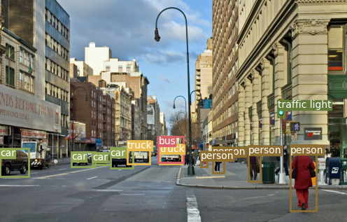
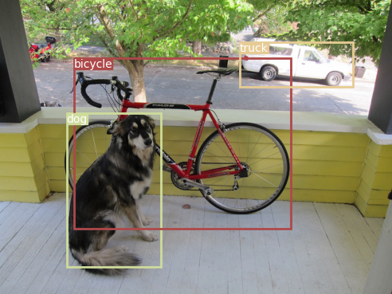
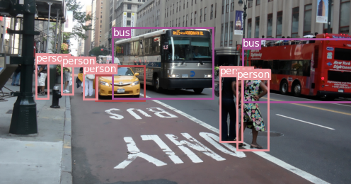

# Pytorch Yolov3 : image

YOLOv3 and YOLOv3_tiny implementation in Pytorch, with support for training, transfer training, object tracking mAP and so on...
Code was tested with following specs:
- Code was tested on Windows 10

## 0.1. Demonstration 1


## 0.2. Demonstration 1


## 0.3. Demonstration 1


## 1. Installation
First, clone or download this GitHub repository.
Install requirements and download from official darknet weights:
```
# yolov3
wget -P model_data https://pjreddie.com/media/files/yolov3.weights

# yolov3-tiny
wget -P model_data https://pjreddie.com/media/files/yolov3-tiny.weights

```

Or you can download darknet weights from my google drive:

https://drive.google.com/drive/folders/1w4KNO2jIlkyzQgUkkcZ18zrC8A1Nqvwa?usp=sharing

## 2. Pretrained weights

You can download pretrained weights from my google drive:

I uploaded weights for the below models
- [x] yolo_v3_coco

https://drive.google.com/file/d/14gquwQfsabRkCbi9Qld_eh725KUvnN83/view?usp=sharing

- [x] yolo_v3_coco_tiny

https://drive.google.com/file/d/1WdLuJfEuPDfpB_aGEGUYT4E1PFkp2SzY/view?usp=sharing

- [x] yolo_v3_voc

"Training is on progress"

- [x] yolo_v3_voc_tiny

https://drive.google.com/file/d/1hObjDyZxkUZICHs7jWxntuBPXttn1_Yc/view?usp=sharing


## 3. Datasets

You can download darknet weights from my google drive:

- [x] coco

https://drive.google.com/file/d/1pMfW7OQKpVRJgSDMcsc5ChzLj9FAtEhM/view?usp=sharing

- [x] voc

https://drive.google.com/file/d/1JpZqg6MBpBhHRN3TXcFynakWC_lIhcb6/view?usp=sharing


Please build the 'Folder Structure' like below.

```
${ROOT}
├── data/ 
│   ├── COCO2017/
│   │    ├── images/
│   │    ├── labels/
│   │    ├── coco.names
│   │    ├── train.txt
│   │    └── valid.txt
│   ├── custom/
│   │    ├── images/
│   │    └── samples/
│   └── VOC2012/
│         ├── images/
│         ├── labels/
│         ├── coco.names
│         ├── train.txt
│         └── valid.txt
```

## 4. Detection demo
Start with using pretrained weights to test predictions on both image and video:

### 4.1. voc:
- Download `pretrained weights` from links above;
- For `Yolov3` image detection test from `trained weight`, set `--model_def` as `config/yolov3.cfg`, `--save_path` as `checkpoints/Yolo_V3_VOC.pth`, `--class_path` as `data/VOC2012/voc2012.names`;
```
    $ python detect_images.py --model_def config/yolov3.cfg --save_path checkpoints/Yolo_V3_VOC.pth --class_path data/VOC2012/voc2012.names
```

- For `Yolov3-tiny` image detection test from `trained weight`, set `--model_def` as `config/yolov3-tiny.cfg`, `--save_path` as `checkpoints/Yolo_V3_VOC_tiny.pth`, `--class_path` as `data/VOC2012/voc2012.names`;
```
    $ python detect_images.py --model_def config/yolov3-tiny.cfg --save_path checkpoints/Yolo_V3_VOC_tiny.pth --class_path data/VOC2012/voc2012.names
```

### 4.2. coco:
- Download `pretrained weights` or `darknet weights` from links above;
- For `Yolov3` image detection test from `darknet weight`, set `--model_def` as `config/yolov3.cfg`, `--save_path` as `checkpoints/yolov3.weights`, `--class_path` as `data/COCO2017/coco.names`;
```
    $ python detect_images.py --model_def config/yolov3.cfg --save_path checkpoints/yolov3.weights --class_path data/COCO2017/coco.names
```

- For `Yolov3` image detection test from `trained weight`, set `--model_def` as `config/yolov3.cfg`, `--save_path` as `checkpoints/Yolo_V3_coco.pth`, `--class_path` as `data/COCO2017/coco.names`;
```
    $ python detect_images.py --model_def config/yolov3.cfg --save_path checkpoints/Yolo_V3_coco.pth --class_path data/COCO2017/coco.names
```

- For `Yolov3-tiny` image detection test from `darknet weight`, set `--model_def` as `config/yolov3-tiny.cfg`, `--save_path` as `checkpoints/yolov3-tiny.weights`, `--class_path` as `data/COCO2017/coco.names`;
```
    $ python detect_images.py --model_def config/yolov3-tiny.cfg --save_path checkpoints/yolov3-tiny.weights --class_path data/COCO2017/coco.names
```

- For `Yolov3-tiny` image detection test from `trained weight`, set `--model_def` as `config/yolov3-tiny.cfg`, `--save_path` as `checkpoints/Yolo_V3_coco_tiny.pth`, `--class_path` as `data/COCO2017/coco.names`;

```
    $ python detect_images.py --model_def config/yolov3-tiny.cfg --save_path checkpoints/Yolo_V3_coco_tiny.pth --class_path data/COCO2017/coco.names
```

## 5. Evaluation - mAP (mean average precision)
Start with using pretrained weights to calculate mAP:

### 5.1. voc:
- Download `pretrained weights` from links above;

- To calculate mAP with `Yolov3` and `VOC` datasets from `pretrained weights`,  set `--model_def` as `config/yolov3.cfg`, `--save_path` as `checkpoints/Yolo_V3_VOC.pth`, `--class_path` as `data/VOC2012/voc2012.names`;
```
    $ python eval_mAP.py --data_config config/VOC.data --model_def config/yolov3.cfg --save_path checkpoints/Yolo_V3_VOC.pth --class_path data/VOC2012/voc2012.names
```

- To calculate mAP with `Yolov3-tiny` and `VOC` datasets from `pretrained weights`,  set `--model_def` as `config/yolov3-tiny.cfg`, `--save_path` as `checkpoints/Yolo_V3_VOC_tiny.pth`, `--class_path` as `data/VOC2012/voc2012.names`;
```
    $ python eval_mAP.py --data_config config/VOC.data --model_def config/yolov3-tiny.cfg --save_path checkpoints/Yolo_V3_VOC_tiny.pth --class_path data/VOC2012/voc2012.names
```

### 5.2. coco:
- Download `pretrained weights` or `darknet weights` from links above;

- To calculate mAP with `Yolov3` and `COCO` datasets from `darknet weights`,  set `--model_def` as `config/yolov3.cfg`, `--save_path` as `checkpoints/yolov3.weights`, `--class_path` as `data/COCO2017/coco.names`;
```
    $ python eval_mAP.py --data_config config/coco.data --model_def config/yolov3.cfg --save_path checkpoints/yolov3.weights --class_path data/COCO2017/coco.names
``` 

- To calculate mAP with `Yolov3` and `COCO` datasets from `pretrained weights`,  set `--model_def` as `config/yolov3.cfg`, `--save_path` as `checkpoints/Yolo_V3_coco.pth`, `--class_path` as `data/COCO2017/coco.names`;    
```    
    $ python eval_mAP.py --data_config config/coco.data --model_def config/yolov3.cfg --save_path checkpoints/Yolo_V3_coco.pth --class_path data/COCO2017/coco.names
```

- To calculate mAP with `Yolov3-tiny` and `COCO` datasets from `darknet weights`,  set `--model_def` as `config/yolov3-tiny.cfg`, `--save_path` as `checkpoints/yolov3-tiny.weights`, `--class_path` as `data/COCO2017/coco.names`;
```
    $ python eval_mAP.py --data_config config/coco.data --model_def config/yolov3-tiny.cfg --save_path checkpoints/yolov3-tiny.weights --class_path data/COCO2017/coco.names
```

- To calculate mAP with `Yolov3-tiny` and `COCO` datasets from `pretrained weights`,  set `--model_def` as `config/yolov3-tiny.cfg`, `--save_path` as `checkpoints/Yolo_V3_coco_tiny.pth`, `--class_path` as `data/COCO2017/coco.names`;    
```    
    $ python eval_mAP.py --data_config config/coco.data --model_def config/yolov3-tiny.cfg --save_path checkpoints/Yolo_V3_coco_tiny.pth --class_path data/COCO2017/coco.names
```

## 6. Training
Start with using pretrained weights to calculate mAP:

### 6.1. voc:
- Download `pretrained weights` or `darknet weights` from links above;
- To train `Yolov3` and `VOC` datasets from `darknet weights`,  set `--data_config` as `config/VOC.data`, `--model_def` as `config/yolov3.cfg`, `--trained_path` as `checkpoints/yolov3.weights` ;
```
    $ python train.py --data_config config/VOC.data --model_def config/yolov3.cfg --trained_path checkpoints/yolov3.weights --save_path checkpoints/Yolo_V3_VOC.pth
```    
    
- To train `Yolov3` and `VOC` datasets from `pretrained weights`,  set `--data_config` as `config/VOC.data`,  `--model_def` as `config/yolov3.cfg`, `--trained_path` as `checkpoints/Yolo_V3_VOC.pth`;
```    
    $ python train.py --data_config config/VOC.data --model_def config/yolov3.cfg --trained_path checkpoints/Yolo_V3_VOC.pth --save_path checkpoints/Yolo_V3_VOC.pth
```    

- To train `Yolov3-tiny` and `VOC` datasets from `darknet weights`,  set `--data_config` as `config/VOC.data`, `--model_def` as `config/yolov3-tiny.cfg`, `--trained_path` as `checkpoints/yolov3-tiny.weights`;    
```
    $ python train.py --data_config config/VOC.data --model_def config/yolov3-tiny.cfg --trained_path checkpoints/yolov3-tiny.weights --save_path checkpoints/Yolo_V3_VOC_tiny.pth
```    

- To train `Yolov3-tiny` and `VOC` datasets from `pretrained weights`,  set `--data_config` as `config/VOC.data`, `--model_def` as `config/yolov3-tiny.cfg`, `--trained_path` as `checkpoints/Yolo_V3_VOC_tiny.pth`;
```    
    $ python train.py --data_config config/VOC.data --model_def config/yolov3-tiny.cfg --trained_path checkpoints/Yolo_V3_VOC_tiny.pth --save_path checkpoints/Yolo_V3_VOC_tiny.pth
```

### 6.2. coco:
- Download `pretrained weights` or `darknet weights` from links above;
- To train `Yolov3` and `COCO` datasets from `darknet weights`,  set `--data_config` as `config/coco.data`, `--model_def` as `config/yolov3.cfg`, `--trained_path` as `checkpoints/yolov3.weights` ;
```
    $ python train.py --data_config config/coco.data --model_def config/yolov3.cfg --trained_path checkpoints/yolov3.weights --save_path checkpoints/Yolo_V3_coco.pth
```    
    
- To train `Yolov3` and `COCO` datasets from `pretrained weights`,  set `--data_config` as `config/coco.data`,  `--model_def` as `config/yolov3.cfg`, `--trained_path` as `checkpoints/Yolo_V3_coco.pth`;
```    
    $ python train.py --data_config config/coco.data --model_def config/yolov3.cfg --trained_path checkpoints/Yolo_V3_coco.pth --save_path checkpoints/Yolo_V3_coco.pth
```    

- To train `Yolov3-tiny` and `COCO` datasets from `darknet weights`,  set `--data_config` as `config/coco.data`, `--model_def` as `config/yolov3-tiny.cfg`, `--trained_path` as `checkpoints/yolov3-tiny.weights`;        
```
    $ python train.py --data_config config/coco.data --model_def config/yolov3-tiny.cfg --trained_path checkpoints/yolov3-tiny.weights --save_path checkpoints/Yolo_V3_coco_tiny.pth
```    
    
- To train `Yolov3-tiny` and `COCO` datasets from `pretrained weights`,  set `--data_config` as `config/coco.data`, `--model_def` as `config/yolov3-tiny.cfg`, `--trained_path` as `checkpoints/Yolo_V3_VOC_tiny.pth`;    
```    
    $ python train.py --data_config config/coco.data --model_def config/yolov3-tiny.cfg --trained_path checkpoints/Yolo_V3_coco_tiny.pth --save_path checkpoints/Yolo_V3_coco_tiny.pth
```

## 7. Folder structure
```
${ROOT}
├── detect_images.py
├── eval_mAP.py
├── evaluate_mAP.py
├── README.md 
├── train.py
├── checkpoints/ 
│   ├── Yolo_V3_coco.pth
│   ├── Yolo_V3_coco_tiny.pth
│   ├── Yolo_V3_VOC.pth
│   ├── Yolo_V3_VOC_tiny.pth
│   ├── yolov3.weights
│   └── yolov3-tiny.weights
├── config/
│   ├── coco.data
│   ├── custom.data
│   ├── VOC.data
│   ├── yolov3.cfg
│   └── yolov3-tiny.cfg
├── data/ 
│   ├── COCO2017/
│   │    ├── images/
│   │    ├── labels/
│   │    ├── coco.names
│   │    ├── train.txt
│   │    └── valid.txt
│   ├── custom/
│   │    └── images/
│   └── VOC2012/
│         ├── images/
│         ├── labels/
│         ├── coco.names
│         ├── train.txt
│         └── valid.txt
├── IMAGES/
│   ├── city.jpg
│   ├── dog.jpg
│   ├── kite.jpg
│   ├── street.jpg
│   ├── Highway.mp4
│   ├── shinjuku.mp4
│   └── street.mp4
├── logs/
├── model/
│   ├── yolo_layer.py
│   └── yolov3.py
├── models/
│   ├── models.py
│   └── yolo_layer.py
├── pred_IMAGES/
└── utils/
     ├── augmentations.py
     ├── datasets.py
     ├── logger.py
     ├── train_utils.py
     └── utils.py
'''

